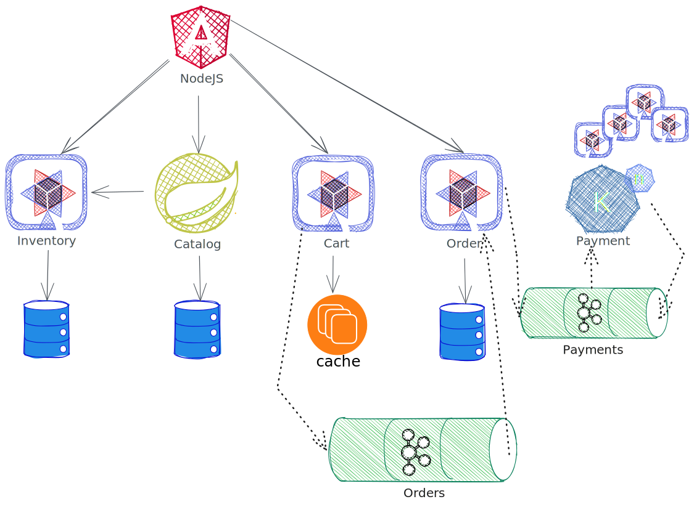
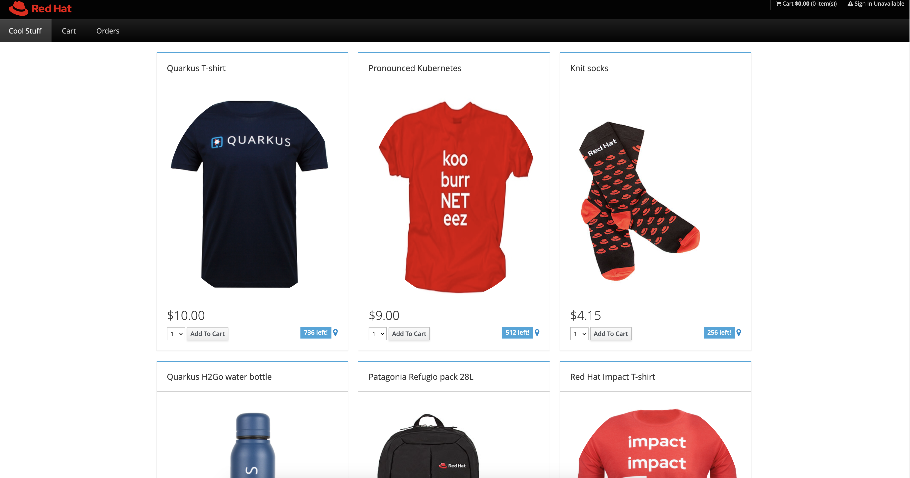
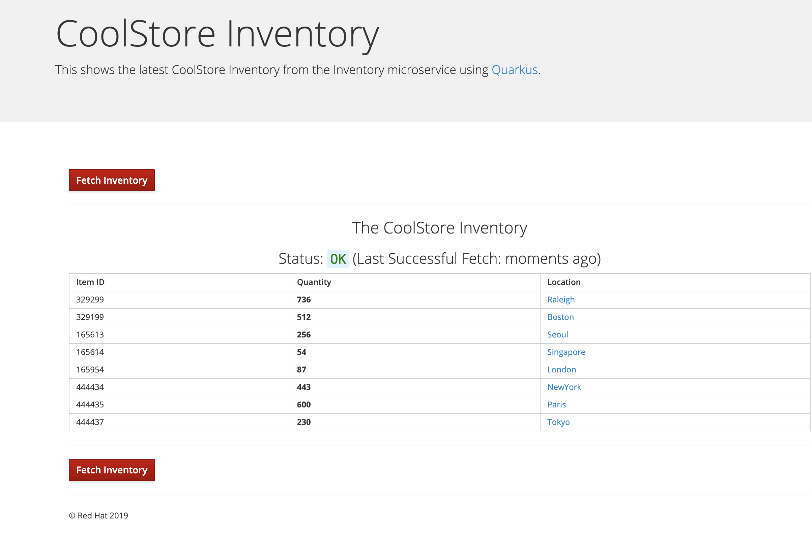
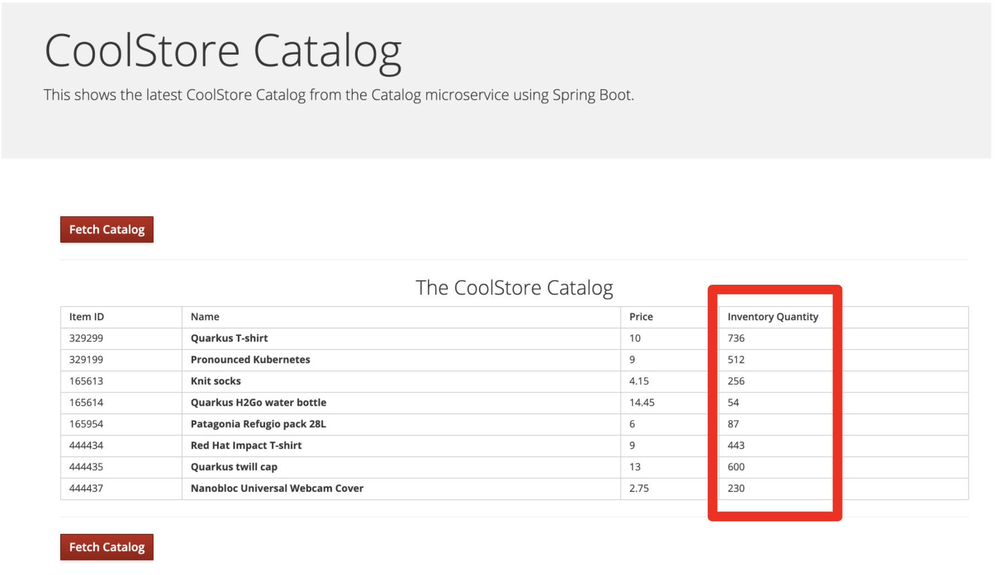
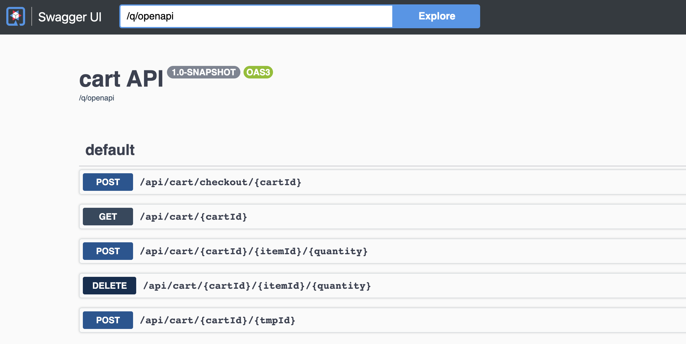

# Shaping tomorrow’s technology: Navigating Cloud Native, Serverless, and Polyglot Programming



[Shaping tomorrow’s technology: Navigating Cloud Native, Serverless, and Polyglot Programming](https://colocatedeventsna2023.sched.com/event/1Rj1o/shaping-tomorrows-technology-navigating-cloud-native-serverless-and-polyglot-programming-naina-singh-shaaf-syed-red-hat)

This is an demo used on our talk at AppDeveloperCon @ KubeCon NA 2023. 
A Coolstore app where users can buy some cool merchandise.
- The UI is built with NodeJS and Angular. And the backend includes multiple services. such as
- Inventory , The stores inventory, how much items are available etc. 
- Catalog , The products API
- Cart, Stores all users carts and intiates the order process by sending a message to Orders
- Orders, Completion and checking of orders
- Payments, Checks whether an payment is successfull given a certain Credit Card. 



## Setup


## Deployment
The deployment is done via the sourcecode. you will need Apache Maven and Java 17 or above to deploy the services to OpenShift


### Inventory
Create the postgresql inventory database to store inventory data. Once the inventory service is deployed it will create default entires in the database. The SQL can be found in src/main/resources/import.sql
```
oc new-app -e POSTGRESQL_USER=inventory -e POSTGRESQL_PASSWORD=mysecretpassword -e POSTGRESQL_DATABASE=inventory openshift/postgresql:latest --name=inventory-database
```

Build and deploy the inventory service to OpenShift namespace.
```
mvn clean compile package -DskipTests -f inventory-service
```
Apply application grouping labels (Optional)
```
oc label dc/inventory app.kubernetes.io/part-of=inventory --overwrite && \
oc label dc/inventory-database app.kubernetes.io/part-of=inventory app.openshift.io/runtime=postgresql --overwrite && \
oc annotate dc/inventory app.openshift.io/connects-to=inventory-database --overwrite && \
oc annotate dc/inventory app.openshift.io/vcs-ref=ocp-4.13 --overwrite
```
The inventory service has a UI for all data in the inventory via http only



### Catalog
Create database for storing the catalog entries, the Catalog entries are created once the service is deployed. you can find them in schema.sql in the catalog-service source/java/resources
```
oc new-app -e POSTGRESQL_USER=catalog -e POSTGRESQL_PASSWORD=mysecretpassword -e POSTGRESQL_DATABASE=catalog openshift/postgresql:latest --name=catalog-database
```
Build and deploy the Catalog service to our OpenShift namespace
```
mvn clean install -Ddekorate.deploy=true -DskipTests -f catalog-service
```
Apply application grouping labels (Optional)
```
oc label dc/catalog app.kubernetes.io/part-of=catalog app.openshift.io/runtime=spring-boot --overwrite && \
oc label dc/catalog-database app.kubernetes.io/part-of=catalog app.openshift.io/runtime=postgresql --overwrite && \
oc annotate dc/catalog app.openshift.io/connects-to=inventory,catalog-database --overwrite && \
oc annotate dc/catalog app.openshift.io/vcs-uri=https://github.com/RedHat-Middleware-Workshops/cloud-native-workshop-v2m4-labs.git --overwrite && \
oc annotate dc/catalog app.openshift.io/vcs-ref=ocp-4.13 --overwrite
```
The catalot service has a UI for all data in the catalog via http only


###  Cart
Create an Infinispan cache server (single instance) for caching the user carts.
```
oc new-app --as-deployment-config quay.io/openshiftlabs/ccn-infinispan:12.0.0.Final-1 --name=datagrid-service -e USER=user -e PASS=pass
```
Build and deploy the Cart service to OpenShift namespace
```
mvn clean package -DskipTests -f cart-service
```

Apply application grouping labels (Optional)
```
oc label dc/cart app.kubernetes.io/part-of=cart app.openshift.io/runtime=quarkus --overwrite && \
oc label dc/datagrid-service app.kubernetes.io/part-of=cart app.openshift.io/runtime=datagrid --overwrite && \
oc annotate dc/cart app.openshift.io/connects-to=catalog,datagrid-service --overwrite && \
oc annotate dc/cart app.openshift.io/vcs-ref=ocp-4.13 --overwrite
```

The cart service also deploys a swagger UI under the following path `/q/swagger-ui/`



### Orders
Create an a mongodDB instance to store orders. 
```
oc new-app --as-deployment-config --docker-image quay.io/openshiftlabs/ccn-mongo:4.0 --name=order-database
```

Building and deploying the Orders service. 
```
mvn clean package -DskipTests -f order-service
```

Adding labels for application grouping (optional)
```
oc label dc/order app.kubernetes.io/part-of=order --overwrite && \
oc label dc/order-database app.kubernetes.io/part-of=order app.openshift.io/runtime=mongodb --overwrite && \
oc annotate dc/order app.openshift.io/connects-to=order-database --overwrite && \
oc annotate dc/order app.openshift.io/vcs-ref=ocp-4.13 --overwrite
```
details of all orders can also be seen via the REST endpoint at `/api/orders`


### Coolstore-ui

Install NodeShift so it can deploy the frontend to OpenShift

```
cd $PROJECT_SOURCE/coolstore-ui && npm install --save-dev nodeshift
```

Deploy to OpenShift and set labels
```
npm run nodeshift && oc expose svc/coolstore-ui && \
oc label dc/coolstore-ui app.kubernetes.io/part-of=coolstore --overwrite && \
oc annotate dc/coolstore-ui app.openshift.io/connects-to=order-cart,catalog,inventory,order --overwrite && \
oc annotate dc/coolstore-ui app.openshift.io/vcs-uri=https://github.com/RedHat-Middleware-Workshops/cloud-native-workshop-v2m4-labs.git --overwrite && \
oc annotate dc/coolstore-ui app.openshift.io/vcs-ref=ocp-4.13 --overwrite
```

### Payment

creating a native image with GraalVM and deploying it to our namespace.
```
mvn clean package -Pnative -DskipTests -f payment-service
```

#### Using Knative Eventing and KEDA

Use the following CR for the Knative Eventing with the payments service.
```
apiVersion: sources.knative.dev/v1beta1
kind: KafkaSource
metadata:
name: kafka-source
spec:
consumerGroup: knative-group
bootstrapServers:
- my-cluster-kafka-bootstrap.user1-cloudnativeapps:9092
  topics:
- orders
  sink:
  ref:
  apiVersion: serving.knative.dev/v1
  kind: Service
  name: payment
```


The following CR is used for KEDA and Payment service
```
apiVersion: sources.knative.dev/v1beta1
kind: KafkaSource
metadata:
name: kafka-source
namespace: user2-cloudnativeapps
annotations:
autoscaling.knative.dev/class: keda.autoscaling.knative.dev
autoscaling.knative.dev/minScale: "0"
autoscaling.knative.dev/maxScale: "10"
keda.autoscaling.knative.dev/pollingInterval: "10"
keda.autoscaling.knative.dev/cooldownPeriod: "10"
keda.autoscaling.knative.dev/kafkaLagThreshold: "10"
spec:
consumerGroup: knative-group
bootstrapServers:
- my-cluster-kafka-bootstrap.user2-cloudnativeapps:9092
topics:
- order
sink:
ref:
apiVersion: serving.knative.dev/v1
kind: Service
name: payment
```